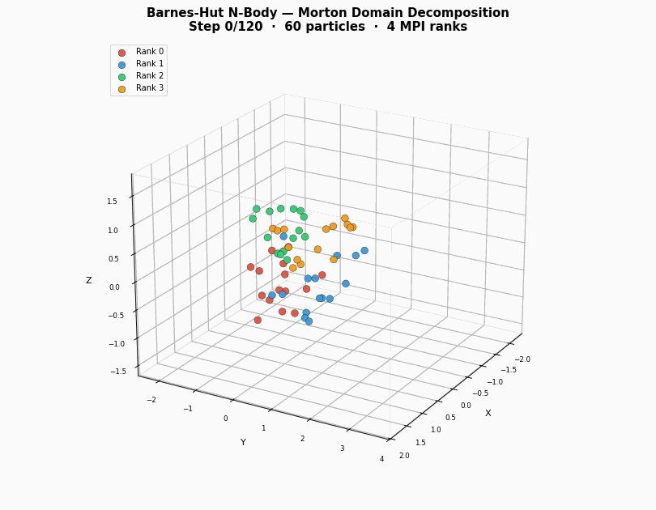
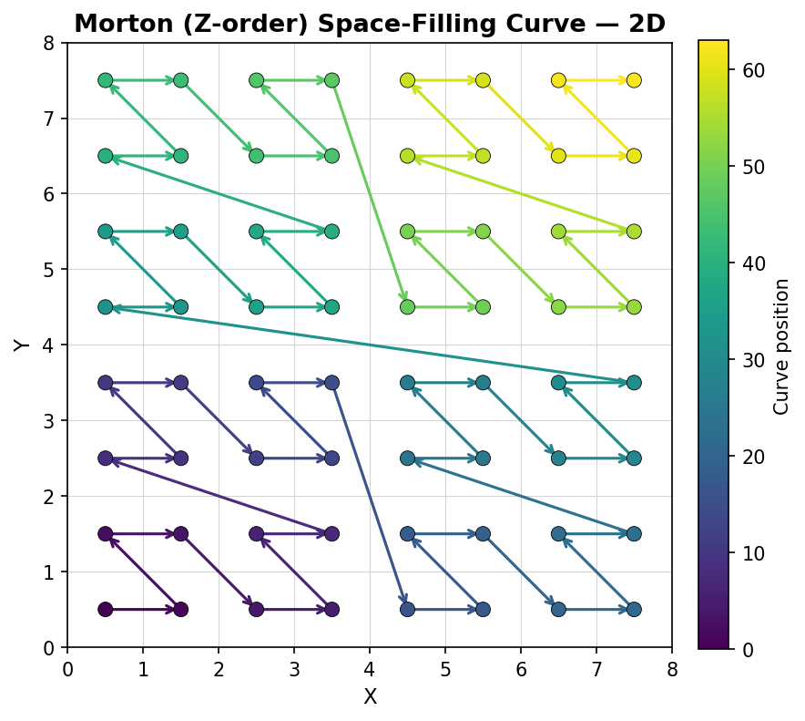
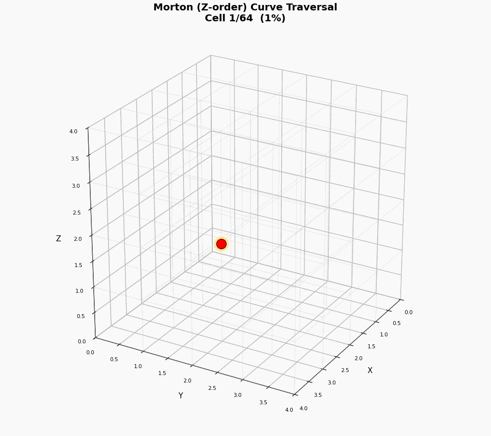

# Barnes-Hut N-Body Galaxy Simulation

<p align="center">
  
</p>

<p align="center">
  <em>60 particles interacting under gravity — colored by MPI rank assignment via Morton curve domain decomposition</em>
</p>

---

## Overview

This project simulates the dynamics of galaxy formation by calculating gravitational interactions between celestial bodies. While direct summation (Brute Force) scales with O(N²), this implementation utilizes the **Barnes-Hut algorithm** to approximate long-range interactions via an octree, reducing complexity to O(N log N).

The project was developed in two phases:

1. **TUM University Project** — Together with my team, we implemented the core Barnes-Hut algorithm with **OpenMP** task-based parallelism, **AVX-512 SIMD** vectorization, and a **Structure of Arrays (SoA)** data layout for cache-efficient computation.

2. **MPI Extension (Solo)** — Building on that foundation, I independently implemented a distributed-memory **MPI-parallelized** version using **Morton (Z-order) space-filling curves** for domain decomposition, following the approach developed at Jülich Supercomputing Centre.

Both versions compile and run on any modern C++17 compiler — AVX-512 is used automatically when available, otherwise a scalar fallback kicks in.

---

## Phase 1: OpenMP + SIMD Barnes-Hut

### Key Features & Optimizations

- **Barnes-Hut Approximation:** Clusters sufficiently far away (determined by the MAC / theta parameter) are treated as single point masses, computed via parallel octree traversal.
- **Parallel Tree Construction & Destruction:** The domain is partitioned into sub-cubes, allowing 8^L independent subtrees to be constructed and destroyed concurrently using OpenMP tasks.
- **Structure of Arrays (SoA):** Particle data is stored in SoA format (separate arrays for X, Y, Z, Mass) to improve cache locality and enable efficient vector loads.
- **SIMD Vectorization (AVX-512):** When available, the force calculation kernel is vectorized using AVX-512 intrinsics with batched processing. On systems without AVX-512, a scalar fallback is used automatically.
- **Correctness Suite:** Includes a Google Test framework that compares Barnes-Hut results against a Brute Force baseline to ensure error remains within tolerance for various theta values.

### Build Instructions

#### Requirements

- C++17 compiler (GCC, Clang, MSVC, etc.)
- CMake ≥ 3.25
- OpenMP support
- (Optional) AVX-512 capable CPU for SIMD acceleration

#### Building

```bash
mkdir build && cd build
cmake ..
make -j
```

To build with unit tests:

```bash
cmake .. -DHPCLab_BUILD_TESTS=ON
make -j
```

To explicitly disable AVX-512 (e.g., for portability):

```bash
cmake .. -DUSE_AVX512=OFF
make -j
```

Tests can be run with `./testBarnesHut` from the build directory.

### Usage

The simulation can be configured via command line arguments or a `config.json` file.

#### Command Line Arguments

Arguments passed to the executable override `config.json` defaults.

| Argument | Description |
|----------|-------------|
| `-n <int>` | Number of particles to simulate. |
| `--scenario <name>` | Name of a specific scenario to load from `scenarios.json`. |
| `--random` | Force generation of random particles (default). |
| `--tree-level <1-4>` | Depth of parallel tree decomposition (1=8, 2=64, 3=512, 4=4096 subtrees). |
| `--simd-batches <int>` | Number of SIMD batches to buffer before processing (buffer length = batches × 8). |
| `--help` | Display help message. |
| `--list` | List available scenarios. |

> **Note:** The `--simd-batches` parameter is limited to 16 by default (statically allocated buffers). To test larger batch sizes, edit `MAX_SIMD_BATCHES` in `include/InteractionForce.h` and recompile.

#### Example

```bash
./barnesHut -n 100000 --tree-level 3 --simd-batches 12
```

#### Configuration File (config.json)

```json
{
  "massRange": 1000.0,
  "positionRange": 1000.0,
  "velocityRange": 10.0,
  "timeStep": 0.1,
  "numParticles": 10000,
  "barnesHutAlgorithm": true,
  "MAC": 0.5
}
```

---

## Phase 2: MPI-Parallelized Barnes-Hut (Jülich Approach)

In the second phase, I independently extended the project with an **MPI-parallelized** implementation using **space-filling curves** (Morton / Z-order curves) for domain decomposition, inspired by the approach developed at Jülich Supercomputing Centre.

### Morton (Z-order) Space-Filling Curve

The Morton curve maps 3D coordinates to a 1D index while preserving spatial locality — particles that are close in space stay close along the curve. This property makes it ideal for distributing particles across MPI ranks.

<p align="center">
  
</p>

<p align="center">
  <em>2D Z-order curve on an 8×8 grid — color indicates position along the curve</em>
</p>

<p align="center">
  
</p>

<p align="center">
  <em>3D animated traversal of the Morton curve on a 4×4×4 octree grid</em>
</p>

### Key Features of MPI Implementation

- **Morton Curve Domain Decomposition:** Particles are ordered using a Morton (Z-order) space-filling curve, which preserves spatial locality. The ordered particles are then distributed equally among MPI ranks.
- **Local Essential Tree (LET):** Each rank builds a local tree for its particles and exchanges aggregated "pseudo-particles" with other ranks for long-range force approximation.
- **Hybrid MPI+OpenMP:** Combines MPI for distributed memory parallelism with OpenMP for shared memory parallelism within each rank.
- **Scalability:** Designed for large-scale simulations on HPC clusters.

### Building & Running

#### Building with MPI

```bash
mkdir build && cd build
cmake .. -DUSE_MPI=ON
make -j
```

To build with both MPI and unit tests:

```bash
cmake .. -DUSE_MPI=ON -DHPCLab_BUILD_TESTS=ON
make -j
```

#### Running the MPI Version

```bash
# Run with 4 MPI processes
mpirun -np 4 ./barnesHutMPI -n 10000

# Run with 8 processes and custom theta
mpirun -np 8 ./barnesHutMPI -n 50000 -t 0.3 -s 100
```

#### MPI Command Line Arguments

| Argument | Description |
|----------|-------------|
| `-n, --particles <N>` | Number of particles to simulate |
| `-t, --theta <θ>` | Opening angle (MAC parameter, default: 0.5) |
| `-s, --steps <N>` | Number of simulation steps |
| `-h, --help` | Display help message |

#### Running MPI Tests

```bash
# Run comparison tests with 4 MPI ranks
mpirun -np 4 ./testMPIBarnesHut
```

The MPI tests compare:
1. **Brute Force** - O(N²) reference implementation
2. **OpenMP+SIMD Barnes-Hut** - Shared-memory parallel implementation
3. **MPI Barnes-Hut** - Distributed-memory parallel implementation (Jülich approach)

### Implementation Details

The MPI implementation consists of:

- `include/MortonCurve.h` / `src/MortonCurve.cpp` — Morton curve encoding/decoding for spatial ordering
- `include/MPIBarnesHut.h` / `src/MPIBarnesHut.cpp` — MPI-parallelized Barnes-Hut algorithm
- `src/mainMPI.cpp` — MPI application entry point
- `tests/MPIBarnesHutTest.cpp` — Comprehensive comparison tests

---

## Visualizations

The Python script `visualization/visualize_morton_curve.py` generates all the animations and figures shown in this README. To regenerate:

```bash
pip install matplotlib numpy
python3 visualization/visualize_morton_curve.py
```

---

## About

This project originated as a university project at **TUM** (Technical University of Munich). The OpenMP + SIMD implementation was developed as part of a team project. The MPI parallelization with space-filling curves was my independent follow-up extension.